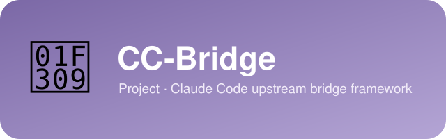

<div align="center">
  
</div>

# CC-Bridge — Claude Code upstream bridge framework

> [简体中文](README.zh-CN.md)

<div align="center">


</div>

A local transparent bridge that lets **Claude Code talk to third-party model
upstreams** (GLM / Kimi / Qwen …) through a single local endpoint. Each upstream
lives in its own adapter module under a `<name>-bridge/` directory and shares the
same framework (`core/`). As a side effect of routing through a spoofed whitelist
model, CC-Bridge **unlocks `/effort xhigh`** for non-first-party providers; it
also supports **multiple API keys with automatic failover** and can **force a
model to always run at `max` thinking effort**.

> **Currently implemented:** `glm` (z.ai GLM-5.2), `ds` (DeepSeek-V4), `mimo`
> (Xiaomi MiMo). `kimi` / `qwen` are reserved placeholders — see
> [Adding a new upstream](#adding-a-new-upstream).

Install it once and start it from **any directory** with a single command:
`cc-bridge`.

## Available upstreams

| upstream | status | adapter | target model |
|----------|--------|---------|--------------|
| `glm` | ✅ implemented | [glm-bridge/](glm-bridge/) | GLM-5.2 on z.ai |
| `ds` | ✅ implemented | [ds-bridge/](ds-bridge/) | DeepSeek-V4 (pro / flash) |
| `mimo` | ✅ implemented | [mimo-bridge/](mimo-bridge/) | MiMo-V2.5-Pro (Xiaomi) |
| `kimi` | 🚧 reserved | [kimi-bridge/](kimi-bridge/) | — |
| `qwen` | 🚧 reserved | [qwen-bridge/](qwen-bridge/) | — |

## What it does

- **Framework + per-upstream adapters.** All upstream-agnostic logic (HTTP
  server, multi-key failover, model rewriting, modelUsage injection, daemon) lives
  in [`core/`](core/). Each upstream's quirks (body adaptation, effort mapping,
  model caps) live in its `<name>-bridge/adapter.js`. Adding an upstream touches
  only one new file + one registry line.
- **Effort unlock.** Routing via a spoofed whitelist model ID bypasses Claude
  Code's client-side effort gate, so `/effort xhigh` works with third-party
  providers. (See [The effort gate](#the-effort-gate-xhigh-vs-max).)
- **Multi-key failover.** Configure multiple keys as numbered variables
  (`API_KEY_1=…`, `API_KEY_2=…`, … — one per line, so each can carry its own
  comment and be disabled by commenting out the line; legacy comma-separated
  `API_KEY=k1,k2` still works). When a key returns `401`/`403` (rejected /
  exhausted), the bridge marks it blocked for 60 s and immediately retries with
  the next key. Transient errors (`429`/`5xx`/network) are first retried on the
  same key, then fall over. The URL never changes — only the key rotates. (See
  [Multi-key failover](#multi-key-failover).)
- **Always-max thinking (GLM).** The GLM adapter forces `reasoning_effort = max`
  on every request, regardless of the client's `/effort` tier.
- **Per-upstream isolation.** Each upstream has its own config
  (`~/.cc-bridge/<upstream>.env`), pid file, and log file, so several upstreams
  can run as daemons side by side (use different `PROXY_PORT`s).
- **Zero runtime dependencies.** Node ≥ 14 built-ins only.

## How it works

```
                              ┌── KEY #1 ──┐
Claude Code ──POST /v1/messages──▶  cc-bridge (127.0.0.1:8787)
  model = <spoof ID>                · rewrite body.model → real target   ├── KEY #2 ──┤  upstream · target
                                    · adapter.adaptRequestBody(body)     │  (failover)│
                                    · on 401/403 → rotate to next key   └────────────┘
                                    · inject modelUsage into the response
```

The upstream is chosen by the `<upstream>` argument (default `ds`). The bridge
loads `core/adapter.js` → the upstream's `adapter.js`, and applies that adapter's
`adaptRequestBody` to every forwarded request.

## The effort gate (xhigh vs max)

> ⚠️ **Always use `/effort xhigh`, never `/effort max`.** In the current VS Code
> extension, `max` is **not usable** — it's absent from the extension's
> `effortLevel` enum and is silently coerced back to `high`, so the model never
> actually runs at `max`. To pin the thinking tier at the maximum, use
> `/effort xhigh` uniformly in **both** the CLI and the VS Code extension.
> `xhigh` is the highest tier the VS Code extension supports and is accepted by
> both.

Claude Code gates `max`/`xhigh` behind a **client-side** check: the active model
ID must be on a Claude whitelist (`claude-opus-4-8`, …) **or** the provider must
be first-party / Bedrock / Foundry. A third-party gateway fails both, so
`/effort max` silently falls back to `high`. Routing through this bridge with a
spoofed whitelist ID satisfies the check; the bridge then rewrites `body.model`
back to the real target before it hits the upstream.

## Prerequisites

- **Node.js ≥ 14** and **npm**, reachable from your PATH.
  - Homebrew users: if `which node` prints nothing, the keg isn't linked. Run
    `brew link --overwrite node@22`, and make sure `/opt/homebrew/bin` is on your
    PATH (add `export PATH="/opt/homebrew/bin:$PATH"` to your shell rc if missing).

## Install

CC-Bridge is distributed as a build tarball on GitHub Releases (the repo is
public, so download with `gh` or `curl`):

```bash
gh release download v2.0.0 --pattern 'cc-bridge-2.0.0.tgz' --dir /tmp --clobber
npm install -g /tmp/cc-bridge-2.0.0.tgz
```

> Permission denied? Either `sudo npm install -g …`, or set a user-writable
> prefix once (`npm config set prefix ~/.local`, ensure `~/.local/bin` is on
> PATH) and re-run without sudo.

After install, `cc-bridge` is on your PATH from any directory. The install
automatically prepares `~/.cc-bridge/ds.env` (a copy of `ds.env.example`) for
the default upstream — fill in your API key and you're ready to
`cc-bridge start`. If the file already exists, it is left untouched.

## Configure

Each upstream's config lives at `~/.cc-bridge/<upstream>.env` (user-level, found
from any working directory). For GLM:

```bash
cc-bridge glm config        # opens ~/.cc-bridge/glm.env in $EDITOR (template generated on first run)
cc-bridge glm config show   # prints current values (API_KEYs masked)
cc-bridge glm config path   # prints the config file path
cc-bridge glm config --import /path/to/.env   # migrate an existing .env
```

```ini
# ~/.cc-bridge/glm.env  — GLM (z.ai GLM-5.2)
API_BASE=https://api.z.ai/api/anthropic
# One key per numbered line — comment each with its account, or comment out a
# line to disable that key. Legacy comma-separated API_KEY=k1,k2 still works.
# account A
API_KEY_1=your_zai_key_1
# account B
API_KEY_2=your_zai_key_2
# MODEL_MAP: spoof->target pairs (comma-separated). opus is Claude Code's main model,
# haiku its fast one — both routed to glm-5.2. First pair is the "main" pair (the
# default model when launching claude). Legacy single-pair SPOOF_MODEL/TARGET_MODEL
# still work.
MODEL_MAP=claude-opus-4-8->glm-5.2,claude-haiku-4-5->glm-5.2
PROXY_PORT=8787
PROXY_LOG=1                             # 0 to silence per-request logging
```

> **Routing:** `MODEL_MAP` maps one or more spoof IDs to real target models
> (`spoof->target` pairs). An incoming `model` matching a spoof is rewritten to that
> pair's target; one already equal to a target is passed through unchanged. Anything
> else is **rejected with HTTP 400** — never silently rewritten. The legacy
> single-pair `SPOOF_MODEL` / `TARGET_MODEL` keys still work (equivalent to one pair).

## Usage

```bash
cc-bridge start           # default upstream (ds), background (detached)
cc-bridge daemon          # alias for 'start' (background)
cc-bridge claude [args]   # start bridge + launch claude pointed at it
cc-bridge stop            # stop the background service
cc-bridge restart         # restart the background service (stop + start)
cc-bridge status          # show running status
cc-bridge stats           # show per-model token / cache-hit stats
cc-bridge logs            # tail the bridge log (Ctrl-C to exit)
cc-bridge health          # probe /health
cc-bridge help            # full help

cc-bridge glm start       # explicit upstream
cc-bridge kimi start      # reserved upstream → reports "not implemented"
```

`cc-bridge claude` exports the bridge env for that `claude` process only and
cleans the bridge up on exit:

```bash
cc-bridge claude -p "hello"
cc-bridge claude -- -p "hello"   # "--" separator also accepted
```

### Making `claude` use the bridge persistently

`cc-bridge` (start / daemon) only runs the service in the background — your normal `claude`
won't use it automatically. Pick one:

- **One session:** `cc-bridge claude` (handles env + cleanup for you).
- **Manual, with the service running:**
  ```bash
  export ANTHROPIC_BASE_URL=http://127.0.0.1:8787
  export ANTHROPIC_API_KEY="$(grep -E '^API_KEY' ~/.cc-bridge/glm.env | head -1 | cut -d= -f2- | cut -d, -f1 | tr -d '\"')"
  export ANTHROPIC_MODEL=claude-opus-4-8
  claude
  ```
  (The bridge rotates its own configured keys; `ANTHROPIC_API_KEY` here just
  needs to be non-empty so the `claude` CLI is willing to send requests.)
- **Persistent:** set `ANTHROPIC_BASE_URL` and `ANTHROPIC_MODEL` in the `env`
  block of `~/.claude/settings.json`. (`claude` then only works while the bridge
  is running.)

Inside `claude`, run `/effort` and pick `xhigh` (**not** `max` — see the warning
above). The bridge logs each request, including the key in use:

```
[bridge 2026-07-24T03:00:00.000Z] POST /v1/messages  model=claude-opus-4-8 → glm-5.2  effort=xhigh  stream=true  key=#1/2
[bridge …]   ← 200  812ms  ct=text/event-stream  key=#1
```

## Multi-key failover

Configure multiple keys as numbered variables (`API_KEY_1=…`, `API_KEY_2=…`,
`API_KEY_3=…` — one per line; legacy comma-separated `API_KEY=k1,k2,k3` also
works). They share one `API_BASE`. The bridge decides when to rotate per request:

| upstream signal                          | bridge action                                                   |
|------------------------------------------|-----------------------------------------------------------------|
| `401` / `403` (key invalid / exhausted)  | block this key for 60 s, **immediately** retry with the next key |
| `429` / `5xx` / network transient        | retry on the **same** key (up to 2×, 200 ms / 500 ms backoff); if still failing, rotate to the next key |
| `400` / `404` (non-transient business error) | forward to the client as-is — rotating keys won't help      |
| every key exhausted                      | return the last error to the client (401/403 → `authentication_error`, else `api_error`) |

- **Block is a soft optimization, not a hard gate.** A key blocked by `401`/`403`
  is skipped for 60 s so each request doesn't pay the cost of re-hitting a known
  dead key. After 60 s it's retried. If all keys happen to be blocked, the
  least-bad one is still tried.
- **Transient errors don't block keys.** A `5xx` or network blip is the gateway's
  problem, not the key's — no key is penalized.
- **Bounded retries.** Each request tries at most `keys × (1 + 2 retries)` calls,
  so failover always terminates.

## Per-model thinking level (GLM / DeepSeek)

Each target model gets a pinned thinking level via `MODEL_THINKING` in the
upstream's config (e.g. `MODEL_THINKING=glm-5.2->max,glm-4.6->none` in
`~/.cc-bridge/glm.env`, or `MODEL_THINKING=deepseek-v4-flash->max` in
`~/.cc-bridge/ds.env`). Levels are `max` / `high` / `none` (`none` = no
thinking). ⚠️ `none` works only on upstreams that accept "no thinking" (e.g.
GLM); DeepSeek's `/anthropic` endpoint does not accept `none` in
`output_config.effort` — a request fails with 400 (verified 2026-08-10), so
use only `max` / `high` there. On every request the adapter looks up the target
model's level and writes it to three fields in concert — `thinking.type`
(`enabled`/`disabled`), `reasoning_effort`, and `output_config.effort` — so
the level holds regardless of the client's `/effort` tier. Models not listed
fall back to `MODEL_THINKING_DEFAULT` (default `max`, set by `defaultThinking`
in the adapter).

## Adding a new upstream

CC-Bridge is built to grow. To add an upstream (e.g. `kimi`):

1. **Create the adapter** at `kimi-bridge/adapter.js`, implementing the adapter
   interface (see [glm-bridge/adapter.js](glm-bridge/adapter.js) and the comments
   in [core/adapter.js](core/adapter.js)):
   - `name`, `displayName`, `defaultTarget`, `defaultSpoof`
   - `defaultThinking` (default thinking level: `max` / `high` / `none`)
   - `modelMaxTokens` (`{ modelId: maxOutputTokens }`)
   - `adaptRequestBody(obj, ctx)` — adapt the Anthropic request body for this
     upstream; `ctx = { target }`
2. **Register it** in [core/adapter.js](core/adapter.js): set `implemented: true`
   for `kimi`.
3. **Document it** in `kimi-bridge/README.md` and add a config template if needed.

That's it — the framework, CLI, multi-key failover, and daemon all work
unchanged. Users then run `cc-bridge kimi start`, edit `~/.cc-bridge/kimi.env`,
etc.

## Files

| path                     | purpose                                            |
|--------------------------|----------------------------------------------------|
| `bin/cc-bridge.js`       | CLI entry — `[upstream] <command>` dispatch        |
| `core/server.js`         | the bridge server: model rewrite, multi-key failover, modelUsage injection |
| `core/adapter.js`        | upstream registry + adapter loader                 |
| `core/config.js`         | per-upstream config find / edit / import / show    |
| `core/daemon.js`         | background process management (per-upstream pid + log) |
| `core/claude.js`         | start bridge + launch `claude` through it          |
| `core/util.js`           | port cleanup / health probe / readiness wait       |
| `glm-bridge/adapter.js`  | GLM (z.ai GLM-5.2) adapter — body adaptation, per-model thinking, model caps |
| `ds-bridge/adapter.js`   | DeepSeek (DeepSeek-V4) adapter — body adaptation, per-model thinking |
| `mimo-bridge/adapter.js` | MiMo (Xiaomi MiMo-V2.5-Pro) adapter — body adaptation, per-model thinking switch |
| `kimi-bridge/`, `qwen-bridge/` | reserved placeholders (adapter + README)    |
| `<name>-bridge/<name>.env.example` | per-upstream config template (GLM / DeepSeek / MiMo filled; Kimi/Qwen reserved) |
| `~/.cc-bridge/<upstream>.env` | real config (yours, gitignored, never packaged) |

## Notes / caveats

- **`xhigh` is required; `max` is broken in the VS Code extension.** The VS Code
  extension (≥2.1.187) validates `effortLevel` against
  `["low","medium","high","xhigh"]` — `max` is not in the enum and is silently
  coerced to `undefined` (→ falls back to `high`). `xhigh` is accepted by both.
- The upstream must accept `output_config.effort` / `reasoning_effort` for the
  effort unlock (and force-max) to take effect.
- Only `POST /v1/messages` (excluding `/v1/messages/count_tokens`) gets its
  `model` rewritten. Other paths (`/v1/models`, …) are forwarded unchanged.
- **Unknown models are rejected with HTTP 400, not silently rewritten.**
- `package.json` `files` excludes `.env`; real keys are never packaged into the
  global install.
- Effort unlock only defeats the **client-side** effort gate. It does not change
  what the model actually does with the effort parameter — that is up to the
  upstream.

## Versioning

This project follows [Semantic Versioning](https://semver.org/). The current
version lives in [VERSION](VERSION); all changes are recorded in
[CHANGELOG.md](CHANGELOG.md).

## Development

This directory is the **development workspace** — the source you edit and push to
git. End users install a published build tarball. The flow is: edit here → test →
bump version → publish → install.

```bash
git clone <repo> && cd CC-Bridge
node --check core/*.js bin/cc-bridge.js glm-bridge/adapter.js   # syntax check after edits
cc-bridge glm start                                             # run from source (background)
```

### Cutting a release

1. Bump `VERSION` and `package.json` `version` (keep them in sync).
2. Add a `## [X.Y.Z] - YYYY-MM-DD` entry at the top of `CHANGELOG.md`.
3. `git commit -a -m "release vX.Y.Z"` then `git tag vX.Y.Z`.
4. `npm pack` → upload `cc-bridge-<ver>.tgz` to the GitHub Release.
5. Install from the Release on the target machine (see [Install](#install)).

## License & Attribution

CC-Bridge is released under the **MIT License** — see [LICENSE.md](LICENSE.md).

Copyright (c) 2026 **All Contributors**.

**Attribution:** If you find CC-Bridge useful, an acknowledgement is appreciated (but not required). Please preserve the copyright notice and license file in any copy or derivative, and link back to the source: https://github.com/xhqing/CC-Bridge.
